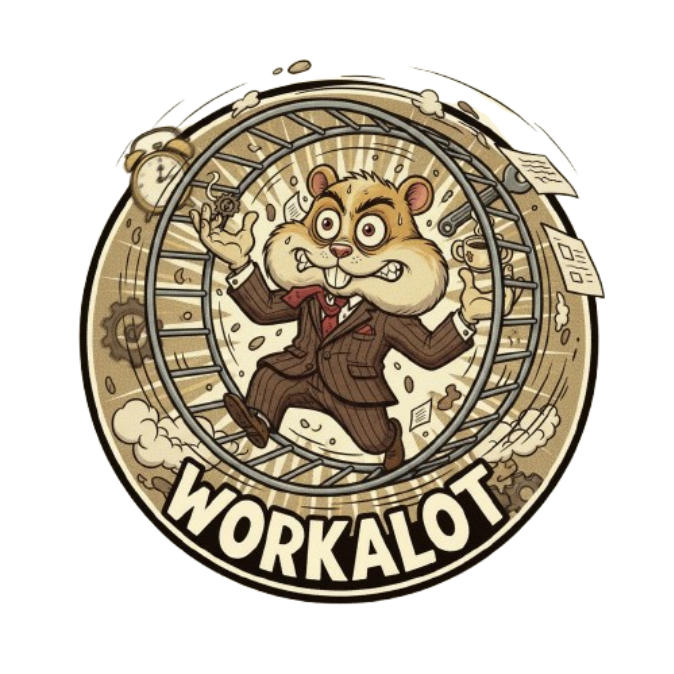

# Workalot



A minimalist timeline visualization tool for tracking work history across multiple chart types.

## Features

- **Timeline View** - Interactive grid showing job history over time
- **Pie Chart** - Visual breakdown of time spent at each company
- **Gantt Chart** - Year-based project timeline view
- **Bar Chart** - Chronological duration comparison

## Usage

1. Edit `history.txt` with your work history in the format:
   ```
   Company Name MM/DD/YYYY - MM/DD/YYYY
   Company Name MM/DD/YYYY - Present
   ```

2. **Important**: Due to browser security restrictions, you need to serve the files from a local server:
   
   **Option A - Python (if installed):**
   ```bash
   python -m http.server 8000
   ```
   Then open `http://localhost:8000` in your browser
   
   **Option B - Node.js (if installed):**
   ```bash
   npx serve .
   ```
   
   **Option C - VS Code Live Server extension:**
   Right-click `index.html` → "Open with Live Server"

3. Switch between chart views using the icons in the top right

## Data Format

Each line should follow this pattern:
- `Company Name Start Date - End Date`
- Use "Present", "Now", or "Current" for ongoing positions
- Dates should be in MM/DD/YYYY format

## Chart Types

- **Timeline**: Calendar grid with hover tooltips
- **Pie Chart**: Proportional time spent visualization
- **Gantt Chart**: Year-based timeline bars
- **Bar Chart**: Duration comparison with chronological ordering

